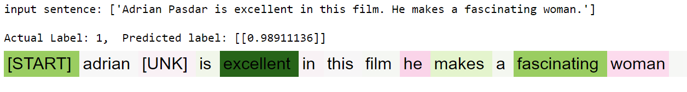
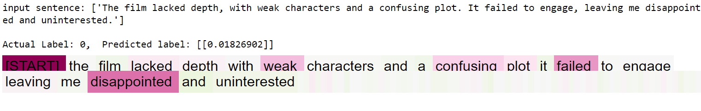

# Transformer Explainability

- Implemented a Transformer model and integrated the explainability method Integrated Gradients (IGs) using TensorFlow.
- Developed an encoder-only Transformer for sentence-level classification.
- Utilized the first token of the sentence (\[START\]) for classification purposes.
- Demonstrated the adaptation of the IGs method, typically applied to images, to a language model.
- Highlighted the words in the sentence that contributed to the prediction decision.
- This method is adaptable to any gradient-based models.

  

<i>The above image shows that the model predicted the given sentence as positive with 98% confidence. Additionally, IG's method highlights that `excellent` and `fascinating` are the two words that contributed most to the model's prediction as positive.</i>
   

<i>The above image shows that the model predicted the given sentence as negative with 98% (1 - 0.018) confidence. IG's method explained the model prediction by highlighting words (in pink) that contributed to the negative prediction.</i>

## Integrated Gradients(IGs): 
- IG aims to explain the relationship between a model's predictions in terms of its features.
- computationally efficient relative to alternative approaches that allow it to scale to large networks.
- In earlier interpretability methods, gradients only describe local changes in your model's prediction function with respect to pixel values and do not fully describe your entire model prediction function.
- The intuition behind IG is to accumulate pixel x's local gradients and attribute its importance as a score for how much it adds or subtracts to your model's overall output class probability. You can break down and compute IG in 3 parts:

1. interpolate small steps along a straight line in the feature space between 0 (a baseline or starting point) and 1 (input pixel's value)
2. compute gradients at each step between your model's predictions with respect to each step
3. approximate the integral between your baseline and input by accumulating (cumulative average) these local gradients.
 

 
<b>Formula for IG:</b>  

